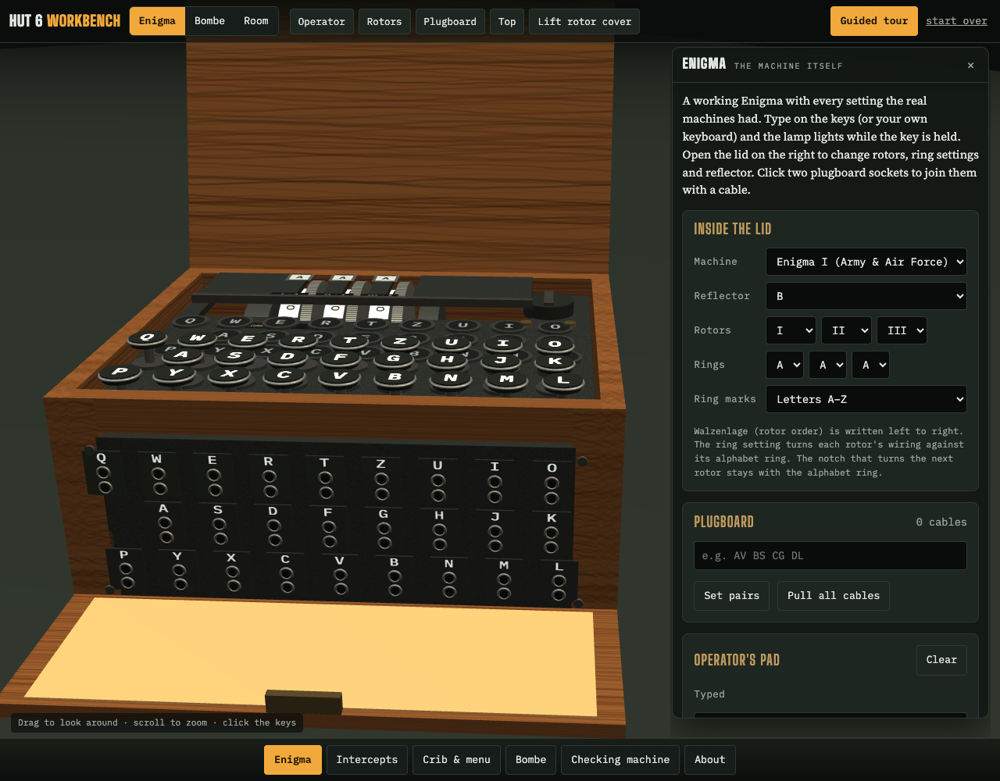
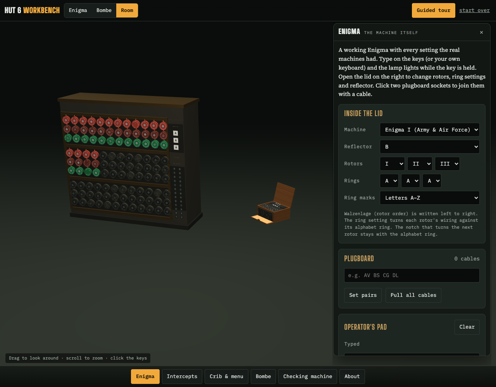
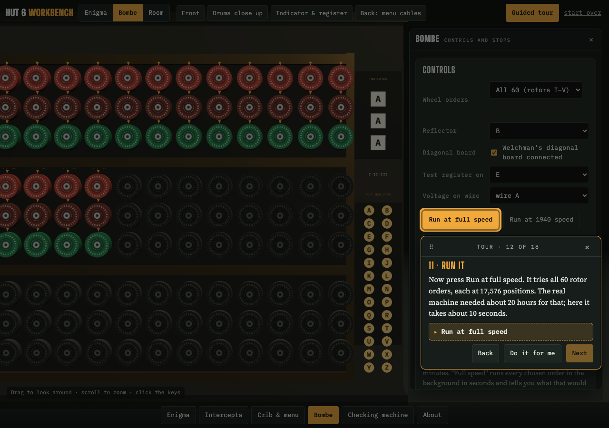
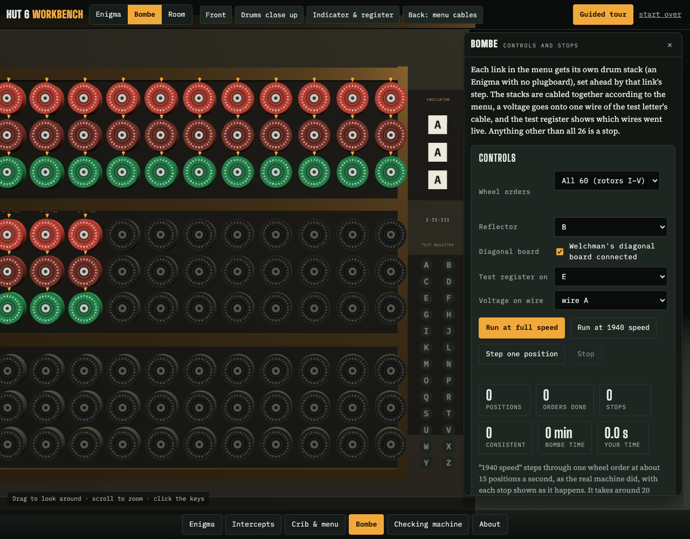

# Hut 6 Workbench

**[Play it in your browser →](https://owenautosport.github.io/enigma-bombe/)**

A working Enigma machine and Turing–Welchman Bombe in your browser. Encrypt your own messages, or break intercepted German traffic the way Bletchley Park did: crib, menu, Bombe, checking machine, daily key.



## What's in it

One room with both machines in it. The Enigma sits on a table, the Bombe stands on the floor
beside it, and **Enigma · Bombe · Room** in the top bar flies the camera between them.
Everything else opens as a window over the machine, from the bar along the bottom.



| Window | What you do there |
|---|---|
| **Enigma** | Every setting the real machines had: machine (I, M3 or M4), rotor order, ring settings, reflectors A/B/C and the thin M4 pair, thumbwheels, and a plugboard you cable up by clicking sockets on the machine itself. The lamp stays lit while the key is held, and a trace shows the current's path. The operator's pad and a whole-message typer are here too. |
| **Intercepts** | Five messages to break: three period-style reconstructions (easy, medium, hard) and two genuine wartime messages. |
| **Crib & menu** | Slide the crib along the ciphertext to rule out impossible positions, then choose which letters go into the menu. The menu graph highlights its loops. |
| **Bombe** | 36 drum stacks set by the menu, 26-wire logic, Welchman's diagonal board, a test register, and the table of stops. Run all 60 wheel orders in seconds, or step at 1940 speed. |
| **Checking machine** | Load a stop, find the ring setting, fill in missing plug pairs from garbled letters, and recover the full daily key from the message indicator. |
| **About** | How accurate this is, and where the messages came from. |

The buttons beside the machine switch move the camera around whichever machine you are at:
**Operator · Rotors · Plugboard · Top** for the Enigma, plus **Lift rotor cover**, and
**Front · Drums close up · Indicator & register · Back: menu cables** for the Bombe, where
the back shows your menu cabled up.

**New to Enigma?** Press **Guided tour**. It walks you through breaking the weather report from your first key press to the German daily key. Each step dims the page, lights up the control you need to press next, and waits until you've pressed it — or does it for you with "Do it for me".





There is also a companion explainer, [Inside the Bombe](docs/explainer.html), which covers how the attack works with diagrams built from real simulated data.

## Run it

It's a static site with nothing to install.

```bash
python3 tools/build.py                        # writes docs/index.html and docs/explainer.html
python3 -m http.server 8000 --directory docs  # then open http://localhost:8000
```

Opening `docs/index.html` straight from disk also works. The room needs WebGL; without it the flat 2D Enigma and Bombe panels stand in, and the machine switch swaps between them.

Deep links: `#enigma`, `#intercepts`, `#menu`, `#bombe`, `#check` and `#about` open that window, and `#tour` starts the guided tour.

## How accurate is it?

The engine is checked by `node tests/test_engine.mjs` against:

- the standard reference vector (rotors I-II-III, reflector B, all at A: `AAAAA → BDZGO`) and the middle rotor's double step (`ADU → ADV AEW BFX`)
- **Operation Barbarossa, 7 July 1941** (Enigma I): the indicator `WXC KCH` decrypts to message key `BLA`, and part 1 decrypts letter for letter
- **The U-534 "von Looks" signal** (Enigma M4)
- **The Dönitz succession signal, 1 May 1945** (Enigma M4, reflector C thin): the indicator `QEOB` gives `CDSZ`, and all 372 letters decrypt
- a Bombe run on the weather-report crib: exactly one stop in the true wheel order, and every stecker it deduces is correct

Rotor and reflector wirings match [Crypto Museum's tables](https://www.cryptomuseum.com/crypto/enigma/wiring.htm).

**The models**

Both machines are built to their published dimensions, at one unit per centimetre.

- **Enigma I / M3 / M4** — case 34 × 28 × 15 cm, rotor discs 10 cm across. QWERTZ keyboard, lampboard and Steckerbrett in the same three staggered rows; each plugboard letter sits above its pair of jacks, as on the machine. The wheels are sunk in the case with only the finger wheels standing proud through the slots in the rotor cover, and the lid stands up at the back with the *Zur Beachtung!* instruction label inside.
- **The Bombe** — cabinet 2.1 m × 1.98 m × 0.61 m on castors, 108 drum positions in three banks of twelve triplets, dark panels in a bronze frame: the metalwork that got it called a "Bronze Goddess". Drums are coloured by the Enigma rotor they emulate — I red, II maroon, III green, IV yellow, V brown, VI cobalt, VII black, VIII silver — so the three rows of a bank show the wheel order at a glance. The top drum of a triplet is the Enigma's left-hand rotor and the bottom one its right-hand rotor, and the top drums are the ones that spin, as on the real machine.

**Simplifications**

- Like the real machine, the Bombe assumes the middle rotor doesn't step inside the menu. You trim long cribs instead.
- The rear cabling uses one junction per letter. Bletchley's actual menu wiring was more involved.
- The two machines share one room and are to each other's scale. Overall dimensions and the drum colour code come from the published figures, but the detail is modelled from photographs, not from measured drawings.
- The Bombe's right-hand panel carries the indicator drums and a test register. On the real machine the checking work was done on separate equipment.
- The British three-rotor Bombe couldn't attack the four-rotor M4, so M4 messages are decoded, not cracked.

## Project layout

```
src/workbench.html   the app: Enigma, Bombe, UI, 3D models (three.js r128) and guided tour
src/explainer.html   the "Inside the Bombe" explainer page
tools/build.py       wraps src/ pages into standalone documents in docs/
tests/               engine tests (Node 18+)
docs/                built site (GitHub Pages) and screenshots
```

The files in `src/` have no `<html>`/`<head>` wrapper so they can also be published as Claude artifacts. Run `tools/build.py` after editing them.

## Sources

- Genuine messages: [Crypto Museum, Enigma M4 message P1030681](https://www.cryptomuseum.com/crypto/enigma/msg/p1030681.htm); [Franklin Heath, Enigma sample messages](https://wiki.franklinheath.co.uk/index.php/Enigma/Sample_Messages), from Geoff Sullivan and Frode Weierud
- Wiring: [Crypto Museum, Enigma wiring](https://www.cryptomuseum.com/crypto/enigma/wiring.htm)
- Dimensions and the drum colour code: Wikipedia, [Enigma machine](https://en.wikipedia.org/wiki/Enigma_machine) and [Bombe](https://en.wikipedia.org/wiki/Bombe); [Crypto Museum, Enigma I](https://www.cryptomuseum.com/crypto/enigma/i/index.htm)
- Shapes and colours modelled from photographs of the Bletchley Park Bombe rebuild and of surviving Enigma I machines on Wikimedia Commons

## Licence

MIT. See [LICENSE](LICENSE).
